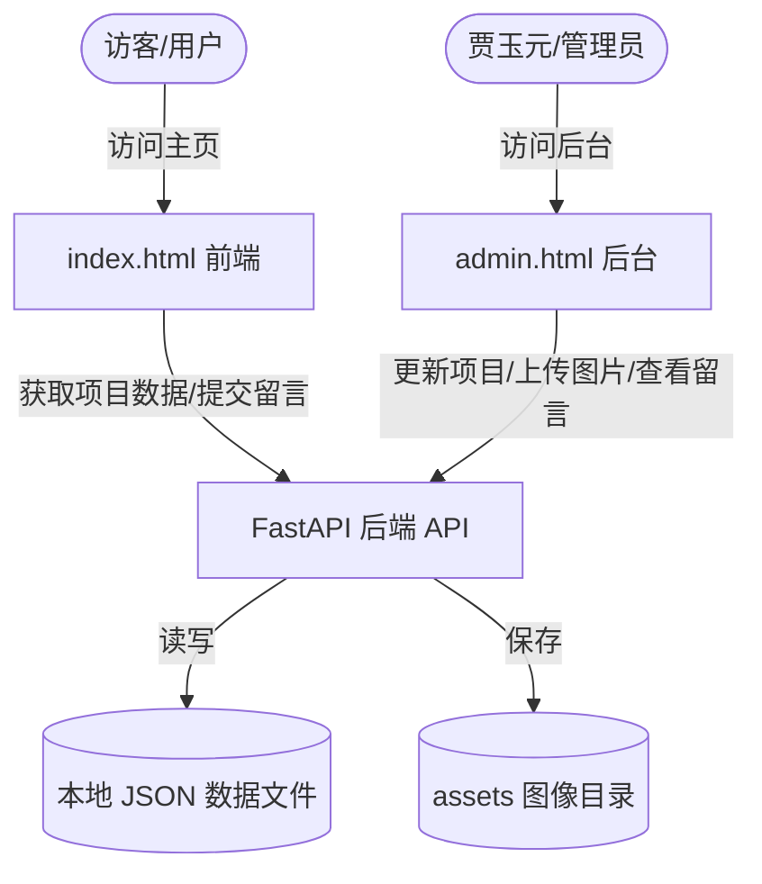

# 个人主页引入 FastAPI 后端与管理系统实现计划

> **状态：✅ 已完成** — 所有计划功能均已实现并部署。

本计划旨在为贾玉元的个人主页网站增加一个基于 Python FastAPI 的轻量级后端服务以及一个可视化的中文后台管理页面 (`admin.html`)。

通过该后端系统，您可以：
1. **在线修改项目信息**：无需修改代码，在后台页面直接编辑项目的标题、技术栈、交付周期和详细描述。
2. **上传新照片**：在后台直接上传并替换个人头像、首屏背景及项目缩略图。
3. **管理客户留言**：查看客户通过“开始合作”表单提交的所有姓名、邮箱、预算和需求描述。

---

## 架构设计

系统将转变为**前后端分离 + 静态托管**的轻量级动态架构：



### 1. 数据持久化方案
为了保持部署的极简性，避免配置复杂的 SQL 数据库，我们将使用**本地 JSON 文件**存储数据（存放在 `data/` 目录下）：
- `data/projects.json`：存放 6 个精选作品的详细数据。
- `data/messages.json`：存放客户提交的合作留言数据。

### 2. 接口设计 (API Routes)
- `GET /`：托管并返回主页 `index.html`。
- `GET /admin`：托管并返回管理后台 `admin.html`。
- `GET /api/projects`：获取所有项目列表。
- `POST /api/projects`：更新某个项目的信息。
- `POST /api/upload`：上传并覆盖图片文件（头像/背景/项目图）。
- `POST /api/messages`：客户提交联系表单留言。
- `GET /api/messages`：管理员查看收到的所有留言列表（带简单的管理后台鉴权）。

---

## 拟更改和新增的文件

### 1. [MODIFY] [index.html](file:///d:/Files/备用/index.html)
- **数据动态化**：移除前端写死的 `projectData` 数组，改为在页面加载时（`DOMContentLoaded`）使用 `fetch('/api/projects')` 从后端接口动态获取并渲染。
- **表单提交真实化**：将表单的模拟提交改为真实的 `POST /api/messages` 异步请求。

### 2. [NEW] [main.py](file:///d:/Files/备用/main.py)
- 使用 FastAPI 编写的核心后端程序。
- 引入 `python-multipart` 支持文件上传。
- 提供项目读写 API、留言保存 API、以及图片上传保存 API。
- 自动托管静态资源目录 `assets/`。

### 3. [NEW] [admin.html](file:///d:/Files/备用/admin.html)
- 专属的**后台管理页面**。
- 提供可视化的项目编辑器（表单），可实时更新每个项目的标题、分类、技术栈、详情。
- 提供文件上传组件，选择图片并点击上传，直接替换头像 `avatar.png`、背景 `hero_bg.png` 或项目图。
- 提供留言列表展示面板，分页或以列表展示所有收到的合作留言。
- **简易身份验证**：引入简单的密码验证，防止未授权访问。

### 4. [NEW] [requirements.txt](file:///d:/Files/备用/requirements.txt)
- 声明项目依赖的 Python 库：
  ```text
  fastapi>=0.100.0
  uvicorn>=0.22.0
  python-multipart>=0.0.6
  ```

---

## 验证与测试计划

1. **本地运行测试**：
   - 在工作区下安装依赖：`pip install -r requirements.txt`。
   - 启动后端：`python -m uvicorn main:app --reload`。
   - 浏览器访问 `http://127.0.0.1:8000` 检查主页面加载是否顺畅，项目数据是否正常显示。
2. **后台管理测试**：
   - 访问 `http://127.0.0.1:8000/admin`。
   - 尝试修改“项目 1”的标题和描述，并点击保存。重新刷新主页，验证修改是否已同步。
   - 尝试上传一张新图片，验证 `assets/` 中的旧图片是否被替换。
3. **留言接收测试**：
   - 在主页上提交一条留言，验证是否能成功写入 `data/messages.json`，并在后台管理面板中即时展示。

## 用户审核与确认

> [!IMPORTANT]
> - 本方案采用 **Python FastAPI + 本地 JSON 数据** 方案，具有免配置数据库、随拷随走、轻量高效的特点。如果您对后端语言、框架或数据存储有其他偏好（如希望使用 SQLite 数据库），请在确认时告诉我。
> - 为了防止外部人员恶意修改您的网站，后台管理页面 `/admin` 我们将设置一个简单的登录密码，默认暂定为 **`admin123`**，您可在 `main.py` 中自行修改。

请您确认此方案。收到您的批准后，我将开始为您构建后端服务！
